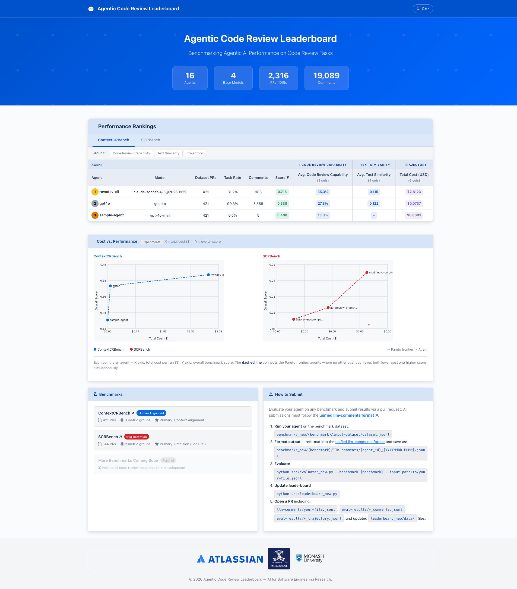

# Agentic Code Review Leaderboard

A benchmarking pipeline for evaluating LLM-based code review agents on real-world pull requests.

<div style="width:80%; margin: auto;">


</div>

---

## Table of Contents

1. [Overview](#overview)
2. [Repository Structure](#repository-structure)
3. [Benchmarks](#benchmarks)
4. [Data Formats](#data-formats)
   - [LLM-Comments (Submission)](#llm-comments-submission)
   - [Eval-Results (Output)](#eval-results-output)
5. [Two-Step Pipeline](#two-step-pipeline)
6. [Trajectory & Cost Metrics](#trajectory--cost-metrics)
7. [Metric Aggregation Modes](#metric-aggregation-modes)
8. [Expression-Based Primary Metrics](#expression-based-primary-metrics)
9. [benchmark_info.json Reference](#benchmark_infojson-reference)
10. [How to Submit](#how-to-submit)
11. [Evaluator Architecture](#evaluator-architecture)
12. [Leaderboard HTML](#leaderboard-html)

---

## Overview

The pipeline has two steps:

```
llm-comments.jsonl  →  [evaluator.py]  →  eval-results/
eval-results/       →  [leaderboard.py] →  leaderboard/data/*.json
                                                (served as static HTML)
```

**Step 1** reads an agent's submission (`llm-comments/*.jsonl`), runs all registered
evaluators, and writes two split output files per submission to `eval-results/`.

**Step 2** aggregates all eval-results across all agents per benchmark and writes
static JSON files consumed by the leaderboard HTML.

---

## Repository Structure

```
benchmarks/
  contextcrbench/
    benchmark_info.json        # benchmark config (evaluators, metrics, display)
    input-dataset/
      dataset.jsonl            # one diff per line {diff_id, diff, pr_url}
      groundtruth.jsonl        # human expert comments {diff_id, comment_file, comment_line, comment_content}
    llm-comments/              # agent submissions (input to evaluator.py)
      {agent_id}_{timestamp}.jsonl
    eval-results/              # output of evaluator.py
      {stem}_comments.jsonl    # one row per comment, all metric columns
      {stem}_trajectory.jsonl  # one row per diff, trajectory fields only
      {stem}_eval.log          # JSONL log of LLM judge calls

  scrbench/
    ...same structure...

src/
  evaluator.py             # Step 1 — evaluate a submission file
  leaderboard.py           # Step 2 — aggregate eval-results → leaderboard JSON
  dataloader.py            # shared data loading utilities
  evaluators/              # evaluator classes
    base.py                    # BaseEvaluator (evaluate(), get_json_logger())
    bug/                       # bug-detection evaluators
    human/                     # human-alignment evaluators
    judge/                     # (Deprecated: Judge evaluators removed - not used by current benchmarks)
    ops/                       # operational cost evaluators

leaderboard/
  index.html                   # main leaderboard (two benchmark tabs)
  format.html                  # submission format documentation
  benchmark-contextcrbench.html
  benchmark-scrbench.html
  script.js                    # all leaderboard JS (data fetch, render, sort)
  styles.css                   # light + dark theme CSS variables
  logos/                       # institution logos
  data/                        # generated by leaderboard.py
    output_filelist.json       # ["data_contextcrbench.json", "data_scrbench.json"]
    benchmark_meta.json        # display names, column groups, group_summary per benchmark
    metric_display_names.json  # human-readable metric column names
    data_contextcrbench.json   # one row per agent
    data_scrbench.json
    statistics.json            # total agents, diffs, comments
```

---

## Benchmarks

### ContextCRBench (`contextcrbench`)
- **Goal:** human-alignment — does the agent identify the same issues as human expert reviewers?
- **Dataset:** 362 real GitHub pull requests across multiple open-source projects
- **Ground truth:** 561 human expert review comments (file, line, content)
- **Primary metric:** `and(metric/human/is_llm_human_aligned, metric/human/is_human_llm_location_matched)` — composite metric requiring BOTH human alignment AND correct localization
- **Task accomplishment mode:** `submitted` — any diff present in llm-comments counts as accomplished
- **Comprehensive dataset:** Full issue/PR context and commit diffs in `commit_diff/` directory

**Dataset Annotation & Quality Control:**

The dataset was manually reviewed and annotated to remove low-quality ground truth. Starting from **421 initial pull requests with 680 ground truth comments**, a verification process identified and excluded problematic annotations:

- **59 fully excluded tasks** (all annotations invalid) — removed entirely from dataset.jsonl
- **18 partially excluded tasks** (some annotations invalid) — retained in dataset.jsonl with only valid ground truth lines
- **119 excluded ground truth lines** — removed from specific (file, line) positions within partially excluded tasks
- **Final cleaned dataset:** 362 tasks with 561 valid ground truth comments

**Exclusion reasons:**
- **OoC (Out of Context) ground truth** (26 tasks) — Annotations refer to code not present in the diff
- **Vague ground truth** (14 tasks) — Ambiguous or unclear annotations that don't provide meaningful feedback
- **Change too large** (13 tasks) — Pull request scope too broad, annotations not specific enough
- **Bot comments** (3 tasks) — Automated tool-generated comments lacking semantic value
- **All changes removed** (3 tasks) — Diff content changed making original annotations invalid

**Example excluded tasks:**
- `airflow_issue_42331_pr_42277_xl_fac840e2` — change too large
- `aspnetcore_issue_28335_pr_28763_l_3b5d4b24` — vague ground truth  
- `gitea_issue_31002_pr_31003_sm_e67258d8` — OoC ground truth
- `aseprite_issue_4781_pr_4925_l_52393980` — bot comment
- `osu_issue_14015_pr_14017_sm_749d7a7b` — all changes removed

### SCRBench (`scrbench`)
- **Goal:** bug-capacity — can the agent identify real security bugs (CVEs/CWEs)?
- **Dataset:** 144 pull requests containing known security vulnerabilities
- **Ground truth:** 243 bug locations with CWE ID, description, and patch validity
- **Primary metric:** `metric/bug/is_comment_location_relevant_matched`
- **Task accomplishment mode:** `has_reviews` — the agent must produce at least one review comment
- **Vulnerability typing:** New `metric/bug/is_bug_comment_type_relevant` uses CWE grouping for semantic matching

---

## Data Formats

### LLM-Comments (Submission)

One JSON line per diff. Filename: `{agent_id}_{YYYYMMDD-HHMM}.jsonl`

```json
{
  "diff_id": "airflow_issue_10616_pr_10617_l_6bfba8c5",
  "submission": {
    "agent_id":  "my-agent",
    "model":     "claude-3-5-sonnet",  // MANDATORY - used for cost calculation via TrajectoryCostMetrics
    "timestamp": "20260301-0900",
    "extra":     {}
  },
  "trajectory": {
    "input_tokens":  12000,
    "output_tokens": 800,
    "total_tokens":  12800,
    "steps":         3,
    "extra":         {"tool_calls": 2, "requests": 1}  // costs auto-calculated by evaluator
  },
  "has_reviews": true,
  "reviews": [
    {
      "file":       "airflow/models/dagbag.py",
      "line":       321,
      "comment":    "Removing modules from sys.modules could cause side effects...",
      "confidence": 0.85,      // optional - confidence score
      "vuln_type":  ["CWE-209"] // optional - for bug benchmarks
    }
  ]
}
```

**Field rules:**
- `diff_id` — must match `dataset.jsonl`
- `submission.model` — **MANDATORY** - used by `TrajectoryCostMetrics` evaluator for automatic cost calculation
- `submission.*` — other sub-fields optional (use `null` if unknown)
- `trajectory.{input_tokens, output_tokens, steps}` — **MANDATORY** - used for cost calculation
- `trajectory.total_tokens` — optional (can be calculated from input + output)
- `trajectory.extra` — put non-standard fields here (e.g., tool_calls, requests)
- `reviews[].file` — path relative to repo root
- `reviews[].line` — single integer (no `line_end`); evaluators apply ±5 line fuzzy window
- `reviews[].comment` — the comment text
- `reviews[].confidence` — optional confidence score (0.0-1.0)
- `reviews[].vuln_type` — optional for bug benchmarks, list of CWE IDs (e.g., `["CWE-209"]`)

**Filename convention:**
```
{agent_id}_{YYYYMMDD-HHMM}.jsonl
{agent_id}_{YYYYMMDD-HHMM}_{suffix}.jsonl   # optional suffix for variants
```

A new run with the same `agent_id` + `timestamp` (including suffix) replaces the previous result.

---

### Eval-Results (Output)

Two files written per submission stem:

#### `{stem}_comments.jsonl` — one row per comment

```json
{
  "diff_id":      "airflow_issue_10616_pr_10617_l_6bfba8c5",
  "comment_file": "airflow/models/dagbag.py",
  "comment_line": 321,
  "comment":      "Removing modules from sys.modules...",
  "agent_id":     "my-agent",
  "timestamp":    "20260301-0900",
  "metric/human/is_human_llm_location_matched":    true,
  "metric/human/llm_comment_rouge1_score":         0.433,
  "metric/human/llm_comment_rougel_score":         0.367,
  "metric/human/llm_comment_bleu_score":           0.154,
  "metric/human/llm_comment_edit_similarity_score": 0.233,
  "metric/human/is_llm_human_aligned":             true,
  "metric/human/is_llm_context_aligned":           true
}
```

#### `{stem}_trajectory.jsonl` — one row per diff (no redundancy)

Contains trajectory metrics aggregated per diff. The `trajectory` field from the input submission
is extracted here and enriched with **cost calculations** from the `TrajectoryCostMetrics` evaluator.

```json
{
  "diff_id":      "airflow_issue_10616_pr_10617_l_6bfba8c5",
  "agent_id":     "my-agent",
  "timestamp":    "20260301-0900",
  "has_reviews":  true,
  "trajectory": {
    "input_tokens":  12000,
    "output_tokens": 800,
    "steps":         3,
    "trajectory_input_costs":   0.036,
    "trajectory_output_costs":  0.016,
    "trajectory_total_costs":   0.052
  }
}
```

**Important:** Cost fields (`trajectory_*_costs`) are **computed outputs** and only appear in 
`*_trajectory.jsonl` files. They are calculated by the `TrajectoryCostMetrics` evaluator using the 
`submission.model` field and token counts from the submission.

#### `{stem}_eval.log` — JSONL log of LLM judge calls

One line per LLM call made by evaluators (e.g. `IsLLMHumanAligned`). Note: Judge evaluators have been deprecated.

---

## Dependency Sync

```bash
uv sync
```

## Two-Step Pipeline

### Step 1 — Evaluate

```bash
cd src

# Select LLM gateway (generic or direct), necessary configuration e.g., .env required
export LLM_GATEWAY_BACKEND=generic

# Evaluate on ContextCRBench
uv run src/evaluator.py \
    --benchmark contextcrbench \
    --input ../benchmarks/contextcrbench/llm-comments/my-agent_20260301-0900.jsonl \
    --benchmarks-root ../benchmarks

# Evaluate on SCRBench
uv run src/evaluator.py \
    --benchmark scrbench \
    --input ../benchmarks/scrbench/llm-comments/my-agent_20260301-0900.jsonl \
    --benchmarks-root ../benchmarks
```

**Options:**
- `--benchmark` — benchmark directory name (e.g. `contextcrbench`, `scrbench`)
- `--input` — path to llm-comments JSONL file
- `--benchmarks-root` — root folder containing benchmark directories (default: `../benchmarks`)
- `--resume` — skip already-evaluated rows (default: overwrite)

The evaluator:
1. Loads `benchmark_info.json` to discover which evaluator classes to run
2. Reads the submission's `submission` block to identify the agent
3. Runs each evaluator class in order (supports composite metrics that depend on prior results)
4. Writes `{stem}_comments.jsonl` and `{stem}_trajectory.jsonl` to `eval-results/`
5. Logs all LLM judge calls to `{stem}_eval.log`

### Step 2 — Generate leaderboard

```bash
cd src

uv run src/leaderboard.py \
    --benchmarks-root ../benchmarks \
    --output-dir ../leaderboard
```

**Options:**
- `--benchmarks-root` — root folder with benchmark directories (default: `../benchmarks`)
- `--output-dir` — where to write `data/*.json` (default: `../leaderboard`)

The leaderboard:
1. Discovers all benchmarks in order of `tab_order` from `benchmark_info.json`
2. For each benchmark, discovers all eval-result stems (latest per `agent_id` wins)
3. Aggregates metrics using the mode declared in `benchmark_info.json → metric_aggregation`
4. Computes per-group summary scores (`group_summary`)
5. Computes `task_accomplishment_rate` using `task_accomplishment_mode`
6. Writes `data_*.json`, `benchmark_meta.json`, `metric_display_names.json`, `output_filelist.json`, `statistics.json`

---

## Trajectory & Cost Metrics

The pipeline uses a dedicated `TrajectoryCostMetrics` evaluator to calculate cost metrics:

- **Input:** Token counts from `submission.trajectory` (`input_tokens`, `output_tokens`) and `submission.model` name
- **Process:** Uses the `genai-prices` library to map model names to provider pricing and compute costs
- **Output:** `trajectory_input_costs`, `trajectory_output_costs`, `trajectory_total_costs` in `*_trajectory.jsonl`

**Data separation:**
- `llm-comments/*.jsonl` (submissions): Contains only token counts and steps, **NO costs**
- `eval-results/*_comments.jsonl`: Comment-level metrics only, **NO trajectory field**
- `eval-results/*_trajectory.jsonl`: Full trajectory data including computed costs

This design ensures:
1. Costs are never submitted by agents — they're always computed deterministically
2. Clear distinction between input data (tokens) and computed outputs (costs)
3. Pareto frontier plot (cost vs. performance) is always consistent and reproducible

---

## Metric Aggregation Modes

Declared in `benchmark_info.json → metric_aggregation` (key: metric name, value: mode string).

| Mode | Formula | When to use |
|---|---|---|
| `precision` | `mean(bool per comment)` | Binary per-comment metrics (default for `bool` returns) |
| `mean` | `mean(float per comment)` | Continuous scores (default for `float` returns, e.g. ROUGE) |
| `recall` | `covered_gt / total_gt` (capped per diff) | Metrics measuring ground-truth coverage |
| `sum_per_diff` | `mean(per-diff sums)` | Trajectory metrics summed within a diff (not yet used; trajectory uses `_trajectory.jsonl` directly) |

Metrics not listed in `metric_aggregation` default to `precision` for `bool` returns and `mean` for `float` returns.

---

## Expression-Based Primary Metrics

The `primary_metric` field in `benchmark_info.json → leaderboard` supports **expression syntax** to create composite metrics from existing evaluators:

### Supported Operations

- **`and(metric1, metric2)`** — Both conditions must be true (logical AND)
- **`or(metric1, metric2)`** — Either condition is true (logical OR)  
- **`not(metric)`** — Negation of a metric

### Evaluation Flow

1. **Expression is evaluated at comment-level** — Each comment gets a boolean result
2. **Aggregation to diff-level** — For venn diagrams, a diff is included if ANY comment evaluates to true
3. **Overall score** — Mean of boolean results across all comments (precision)

### Example

```json
{
  "leaderboard": {
    "primary_metric": "and(metric/human/is_llm_human_aligned, metric/human/is_human_llm_location_matched)"
  }
}
```

This composite metric requires comments to be **both semantically aligned with human reviewers AND correctly localized** to the right file/line.

**Benefits:**
- No hardcoding — expressions live entirely in config
- Metrics are still evaluated independently (all data preserved)
- Backward compatible — simple metric names still work
- Venn diagram automatically uses the same expression

**Note:** Individual metrics in the expression must still be declared in `evaluator_classes` and will appear in eval-results files. Use `column_groups` to control leaderboard visibility.

---

## `benchmark_info.json` Reference

```json
{
  "name":                    "contextcrbench",
  "display_name":            "ContextCRBench",
  "benchmark_goal":          "human-alignment",
  "tab_order":               1,
  "dataset_total_diffs":     421,
  "task_accomplishment_mode": "submitted",
  "is_ground_truth_eligible": true,

  "evaluator_classes": [
    "human.IsHumanLLMLocationMatched",
    "human.LLMCommentRouge1Score",
    "human.LLMCommentRougeLScore",
    "human.LLMCommentBleuScore",
    "human.LLMCommentEditSimilarityScore",
    "human.IsLLMHumanAligned",
    "human.IsLLMContextAligned"
  ],

  "metric_aggregation": {
    "metric/human/is_human_llm_location_matched":     "recall",
    "metric/human/llm_comment_rouge1_score":          "mean",
    "metric/human/llm_comment_rougel_score":          "mean",
    "metric/human/llm_comment_bleu_score":            "mean",
    "metric/human/llm_comment_edit_similarity_score": "mean",
    "metric/human/is_llm_human_aligned":              "precision",
    "metric/human/is_llm_context_aligned":            "precision"
  },

  "leaderboard": {
    "primary_metric": "and(metric/human/is_llm_human_aligned, metric/human/is_human_llm_location_matched)",
    // Supports expressions: and(), or(), not() for composite metrics
    // Simple metric names still work for backward compatibility

    "column_groups": {
      "Code Review Capability": [...metric keys...],
      "Text Similarity":        [...metric keys...],
      "Trajectory":             [...trajectory keys...]
    },

    "group_summary": {
      "Code Review Capability": {
        "method":  "mean",
        "columns": [...metric keys to average...]
      },
      "Text Similarity": {
        "method":  "mean",
        "columns": [...metric keys to average...]
      },
      "Trajectory": {
        "method": "pick",
        "column": "trajectory/total_costs"
      }
    },

    "display_names": {
      "metric/human/is_llm_human_aligned": "Human Alignment"
    }
  },

  "venn_diagram": {
    "enabled": true,
    "top_n_agents": 3,
    "min_score_threshold": 0.0
    // NOTE: No "primary_metric" field - always uses leaderboard.primary_metric
    // Supports expression-based metrics automatically
  }
}
```

**Key fields:**
- `tab_order` — integer controlling benchmark tab order in leaderboard (lower = leftmost)
- `dataset_total_diffs` — total number of diffs in the full benchmark dataset (used for task accomplishment rate)
- `task_accomplishment_mode` — `"submitted"` (presence in llm-comments = accomplished) or `"has_reviews"` (must have ≥1 non-empty review)
- `group_summary.method` — `"mean"` averages all listed columns; `"pick"` reads a single column directly
- `evaluator_classes` — ordered list; composite metrics must come after their dependencies
- `venn_diagram.enabled` — set to `true` to enable venn diagram visualization
- `venn_diagram.top_n_agents` — number of top agents to include (default: 3)
- `venn_diagram.min_score_threshold` — minimum score to be eligible (default: 0.0)
- **Venn diagram always uses `leaderboard.primary_metric`** — no separate configuration needed, supports expressions automatically

---

## How to Submit

1. **Generate comments** using `benchmarks/{benchmark}/input-dataset/dataset.jsonl`
2. **Format** your output as the unified llm-comments JSONL (see [Data Formats](#data-formats) or `leaderboard/format.html`)
3. **Save** as `benchmarks/{benchmark}/llm-comments/{agent_id}_{YYYYMMDD-HHMM}.jsonl`
4. **Evaluate** (Step 1 above) — produces `eval-results/{stem}_comments.jsonl` and `{stem}_trajectory.jsonl`
5. **Update leaderboard** (Step 2 above) — regenerates all `data/*.json` files
6. **Open a PR** with:
   - `benchmarks/{benchmark}/llm-comments/{stem}.jsonl`
   - `benchmarks/{benchmark}/eval-results/{stem}_comments.jsonl`
   - `benchmarks/{benchmark}/eval-results/{stem}_trajectory.jsonl`
   - Updated `leaderboard/data/*.json`

---

## Evaluator Architecture

The evaluator system is built on the `BaseEvaluator` class in `src/evaluators/base.py`:

```python
class BaseEvaluator:
    evaluation_name = "metric/group/evaluator_name"
    
    def evaluate(self, diff_row, submission, prior_evals) -> dict:
        """Returns {metric_name: score} or {metric_name: None} if not applicable."""
        pass
```

**Key evaluators:**

| Class | Module | Purpose | Output |
|---|---|---|---|
| `TrajectoryCostMetrics` | `ops/` | Calculates monetary costs from token counts | `trajectory_input_costs`, `trajectory_output_costs`, `trajectory_total_costs` |
| `IsHumanLLMLocationMatched` | `human/` | Location matching with fuzzy window | `metric/human/is_human_llm_location_matched` |
| `IsLLMHumanAligned` | `human/` | Overall human alignment (composite) | `metric/human/is_llm_human_aligned` |
| `IsBugLocationMatched` | `bug/` | Exact location match for security bugs | `metric/bug/is_bug_location_matched` |
| `IsBugCommentTypeRelevant` | `bug/` | CWE-aware semantic matching | `metric/bug/is_bug_comment_type_relevant` |
| ~~`IsLLMContextAligned`~~ | ~~`judge/`~~ | ~~LLM-as-judge: context relevance~~ | ~~Removed - unused~~ |
| ~~`IsCommentInformative`~~ | ~~`judge/`~~ | ~~LLM-as-judge: informativeness~~ | ~~Removed - unused~~ |
| ~~`IsRelevantCommentDiff`~~ | ~~`judge/`~~ | ~~LLM-as-judge: relevance~~ | ~~Removed - unused~~ |

**Evaluation order matters:**
- Evaluators listed in `benchmark_info.json → evaluator_classes` run in order
- Composite metrics (e.g., `IsLLMHumanAligned`) depend on prior evaluators
- Results from prior evaluators are passed via `prior_evals` parameter

---

## Evaluation Versioning

Each benchmark maintains an **evaluation version** that represents a snapshot of all metrics and LLM judges used for that benchmark. This allows tracking when evaluation criteria change and helps maintain result comparability.

### Philosophy

- **Version represents the entire evaluator set** - Not individual evaluators
- **Independent per benchmark** - ContextCRBench and SCRBench have separate version numbers
- **Semantic versioning** - MAJOR.MINOR format
  - **MAJOR bump** (e.g., 1.0 → 2.0): Add/remove evaluator, change LLM model, major prompt changes
  - **MINOR bump** (e.g., 1.0 → 1.1): Model version update, bug fixes, minor prompt tweaks

### Files

**Per-benchmark versioning files:**

- `benchmarks/{benchmark}/evaluation_versions.json` - Machine-readable version definitions
  ```json
  {
    "current_version": "1.0",
    "versions": {
      "1.0": {
        "released_date": "2026-01-10",
        "evaluators": [
          {"class": "human.IsLLMContextAligned", "llm_model": "gpt-5.1-2025-11-13"},
          {"class": "ops.TrajectoryCostMetrics", "llm_model": null}
        ]
      }
    }
  }
  ```

- `benchmarks/{benchmark}/evaluation_changelog.md` - Human-readable changelog with version descriptions

### Workflow for Maintainers

#### When to Bump Versions

**MAJOR version bump:**
- Adding a new evaluator
- Removing an evaluator
- Switching to a different LLM model (e.g., gpt-4 → gpt-5)
- Major changes to evaluation prompts or logic

**MINOR version bump:**
- Updating to a newer version of the same model (e.g., gpt-5.0 → gpt-5.1)
- Bug fixes in evaluator code
- Minor prompt improvements

#### How to Bump a Version

1. **Update evaluation_versions.json** - Change `current_version` and add new version entry
2. **Update evaluation_changelog.md** - Add description of changes
3. **Update benchmark_info.json** - Change `current_version` field
4. **Run leaderboard generator** - `python src/leaderboard.py` to regenerate with new version

### Viewing Evaluation Versions

- **In leaderboard table:** Hover over agent name to see evaluation version in tooltip
- **Evaluation Versions page:** Click "Evaluation Versions" button in navbar for full version history

⚠️ **Important:** Results from different evaluation versions may not be directly comparable.

---

## leaderboard HTML

The leaderboard is a self-contained static HTML app in `leaderboard/`.

| Page | URL | Description |
|---|---|---|
| Main leaderboard | `index.html` | Two-tab table with sorting, group collapse, Pareto plot |
| Submission format | `format.html` | Full schema documentation for llm-comments format |
| ContextCRBench | `benchmark-contextcrbench.html` | Examples, groundtruth, metrics |
| SCRBench | `benchmark-scrbench.html` | Examples, groundtruth, metrics, CWE info |

**Features:**
- Light / dark theme toggle (persisted in `localStorage`)
- Metric group columns collapse/expand — collapsed state shows one representative summary score per group
- Pareto frontier scatter plot (cost vs. overall score) — `[Experimental]`
- All configuration driven by `benchmark_meta.json` — no JS changes needed for new metrics or benchmarks

To deploy, copy `leaderboard/` to any static file host or serve locally:
```bash
cd leaderboard && python3 -m http.server 8080
```
