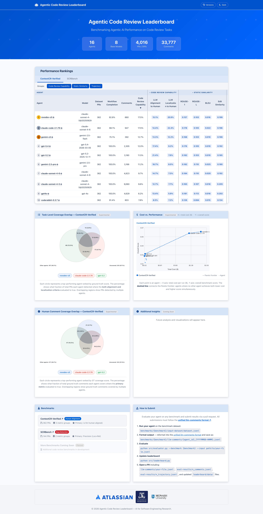

# Agentic Code Review Leaderboard

A benchmarking pipeline for evaluating LLM-based code review agents on real-world pull requests.

<div style="width:80%; margin: auto;">


</div>

---

## Table of Contents

1. [Overview](#overview)
2. [Repository Structure](#repository-structure)
3. [Benchmarks](#benchmarks)
4. [Data Formats](#data-formats)
   - [LLM-Comments (Submission)](#llm-comments-submission)
   - [Eval-Results (Output)](#eval-results-output)
5. [Quick Start](#quick-start)
6. [Documentation](#documentation)

---

## Overview

The pipeline has two steps:

```
llm-comments.jsonl  →  [evaluator.py]  →  eval-results/
eval-results/       →  [leaderboard.py] →  leaderboard/data/*.json
                                                (served as static HTML)
```

**Step 1** reads an agent's submission (`llm-comments/*.jsonl`), runs all registered
evaluators, and writes two split output files per submission to `eval-results/`.

**Step 2** aggregates all eval-results across all agents per benchmark and writes
static JSON files consumed by the leaderboard HTML.

---

## Repository Structure

```
benchmarks/
  contextcr-verified/
    benchmark_info.json        # benchmark config (evaluators, metrics, display)
    input-dataset/
      dataset.jsonl            # one diff per line {diff_id, diff, pr_url}
      groundtruth.jsonl        # human expert comments {diff_id, comment_file, comment_line, comment_content}
    llm-comments/              # agent submissions (input to evaluator.py)
      {agent_id}_{timestamp}.jsonl
    eval-results/              # output of evaluator.py
      {stem}_comments.jsonl    # one row per comment, all metric columns
      {stem}_trajectory.jsonl  # one row per diff, trajectory fields only
      {stem}_eval.log          # JSONL log of LLM judge calls

  scrbench/
    ...same structure...

src/
  evaluator.py             # Step 1 — evaluate a submission file
  leaderboard.py           # Step 2 — aggregate eval-results → leaderboard JSON
  dataloader.py            # shared data loading utilities
  evaluators/              # evaluator classes
    base.py                    # BaseEvaluator (evaluate(), get_json_logger())
    bug/                       # bug-detection evaluators
    human/                     # human-alignment evaluators
    judge/                     # (Deprecated: Judge evaluators removed - not used by current benchmarks)
    ops/                       # operational cost evaluators

leaderboard/
  index.html                   # main leaderboard (two benchmark tabs)
  format.html                  # submission format documentation
  benchmark-contextcr-verified.html
  benchmark-scrbench.html
  script.js                    # all leaderboard JS (data fetch, render, sort)
  styles.css                   # light + dark theme CSS variables
  logos/                       # institution logos
  data/                        # generated by leaderboard.py
    output_filelist.json       # ["data_contextcr-verified.json", "data_scrbench.json"]
    benchmark_meta.json        # display names, column groups, group_summary per benchmark
    metric_display_names.json  # human-readable metric column names
    data_contextcr-verified.json   # one row per agent
    data_scrbench.json
    statistics.json            # total agents, diffs, comments
```

---

## Benchmarks

See 📖 **[Benchmarks Guide](docs/BENCHMARKS.md)** for detailed descriptions of each benchmark, dataset annotation, quality control, and ground truth.

**Available benchmarks:**
- **ContextCR-Verified** — human-alignment evaluation on 362 real GitHub PRs
- **SCRBench** — security bug detection on 144 vulnerable pull requests

---

## Data Formats

### LLM-Comments (Submission)

One JSON line per diff. Filename: `{agent_id}_{YYYYMMDD-HHMM}.jsonl`

```json
{
  "diff_id": "airflow_issue_10616_pr_10617_l_6bfba8c5",
  "submission": {
    "agent_id":  "my-agent",
    "model":     "claude-3-5-sonnet",  // MANDATORY - used for cost calculation via TrajectoryCostMetrics
    "timestamp": "20260301-0900",
    "extra":     {}
  },
  "trajectory": {
    "input_tokens":  12000,
    "output_tokens": 800,
    "total_tokens":  12800,
    "steps":         3,
    "extra":         {"tool_calls": 2, "requests": 1}  // costs auto-calculated by evaluator
  },
  "has_reviews": true,
  "reviews": [
    {
      "file":       "airflow/models/dagbag.py",
      "line":       321,
      "comment":    "Removing modules from sys.modules could cause side effects...",
      "confidence": 0.85,      // optional - confidence score
      "vuln_type":  ["CWE-209"] // optional - for bug benchmarks
    }
  ]
}
```

**Field rules:**
- `diff_id` — must match `dataset.jsonl`
- `submission.model` — **MANDATORY** - used by `TrajectoryCostMetrics` evaluator for automatic cost calculation
- `submission.*` — other sub-fields optional (use `null` if unknown)
- `trajectory.{input_tokens, output_tokens, steps}` — **MANDATORY** - used for cost calculation
- `trajectory.total_tokens` — optional (can be calculated from input + output)
- `trajectory.extra` — put non-standard fields here (e.g., tool_calls, requests)
- `reviews[].file` — path relative to repo root
- `reviews[].line` — single integer (no `line_end`); evaluators apply ±5 line fuzzy window
- `reviews[].comment` — the comment text
- `reviews[].confidence` — optional confidence score (0.0-1.0)
- `reviews[].vuln_type` — optional for bug benchmarks, list of CWE IDs (e.g., `["CWE-209"]`)

**Filename convention:**
```
{agent_id}_{YYYYMMDD-HHMM}.jsonl
{agent_id}_{YYYYMMDD-HHMM}_{suffix}.jsonl   # optional suffix for variants
```

A new run with the same `agent_id` + `timestamp` (including suffix) replaces the previous result.

---

### Eval-Results (Output)

Two files written per submission stem:

#### `{stem}_comments.jsonl` — one row per comment

```json
{
  "diff_id":      "airflow_issue_10616_pr_10617_l_6bfba8c5",
  "comment_file": "airflow/models/dagbag.py",
  "comment_line": 321,
  "comment":      "Removing modules from sys.modules...",
  "agent_id":     "my-agent",
  "timestamp":    "20260301-0900",
  "metric/human/is_human_llm_location_matched":    true,
  "metric/human/llm_comment_rouge1_score":         0.433,
  "metric/human/llm_comment_rougel_score":         0.367,
  "metric/human/llm_comment_bleu_score":           0.154,
  "metric/human/llm_comment_edit_similarity_score": 0.233,
  "metric/human/is_llm_human_aligned":             true,
  "metric/human/is_llm_context_aligned":           true
}
```

#### `{stem}_trajectory.jsonl` — one row per diff (no redundancy)

Contains trajectory metrics aggregated per diff. The `trajectory` field from the input submission
is extracted here and enriched with **cost calculations** from the `TrajectoryCostMetrics` evaluator.

```json
{
  "diff_id":      "airflow_issue_10616_pr_10617_l_6bfba8c5",
  "agent_id":     "my-agent",
  "timestamp":    "20260301-0900",
  "has_reviews":  true,
  "trajectory": {
    "input_tokens":  12000,
    "output_tokens": 800,
    "steps":         3,
    "trajectory_input_costs":   0.036,
    "trajectory_output_costs":  0.016,
    "trajectory_total_costs":   0.052
  }
}
```

**Important:** Cost fields (`trajectory_*_costs`) are **computed outputs** and only appear in 
`*_trajectory.jsonl` files. They are calculated by the `TrajectoryCostMetrics` evaluator using the 
`submission.model` field and token counts from the submission.

#### `{stem}_eval.log` — JSONL log of LLM judge calls

One line per LLM call made by evaluators (e.g. `IsLLMHumanAligned`). Note: Judge evaluators have been deprecated.

---

---

## Quick Start

### Installation

```bash
uv sync
```

### Running Evaluations

See 📖 **[Operations Guide](docs/OPERATIONS.md)** for complete instructions on:
- Running the two-step evaluation pipeline
- Generating leaderboard data
- Submitting new agent results
- Understanding evaluator architecture
- Evaluation versioning

---

## Documentation

- 📖 **[Operations Guide](docs/OPERATIONS.md)** — Running evaluations, submissions, deployment
- 📖 **[Benchmarks Guide](docs/BENCHMARKS.md)** — Dataset details, quality control, ground truth
- 📖 **[Metrics Reference](docs/METRICS.md)** — Metric aggregation, expressions, trajectory costs
